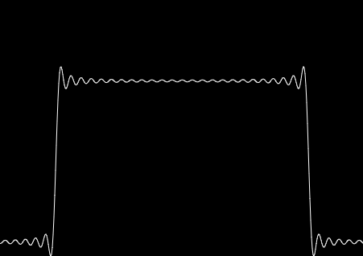

<p align="center">
  <a href="" rel="noopener">
 </a>
</p>

<h3 align="center">Fourier Series</h3>

<div align="center">

[]()
[](https://github.com/kylelobo/The-Documentation-Compendium/issues)
[](https://github.com/kylelobo/The-Documentation-Compendium/pulls)
[](/LICENSE)

</div>`

---
<p align="center"> 
This is a simple animation of the Fourier series graph being drawn by rotating lines in p5js. The animation demonstrates how the sum of sine and cosine functions can converge to the original function. The code is open-source and available on GitHub.
    <br> 
</p>

## 📝 Table of Contents

- [About](#about)
- [Getting Started](#getting_started)
- [Usage](#usage)
- [Built Using](#built_using)
- [Authors](#authors)
- [Acknowledgments](#acknowledgement)

## 🧐 About <a name = "about"></a>

This project is a simple animation of the Fourier series graph being drawn by a bunch of lines rotating from each other using p5js, a JavaScript library for creative coding. The animation shows how the sum of sine and cosine functions can gradually converge to the original function as more terms are added to the Fourier series. The code is open-source and available on GitHub, so feel free to check it out and explore the world of creative coding and mathematical art!.

## 🏁 Getting Started <a name = "getting_started"></a>

These instructions will get you a copy of the project up and running on your local machine for development and testing purposes. 

### Prerequisites

What things you need to install the software and how to install them.

```
Node
Yarn
```

### Installing

A step by step series of examples that tell you how to get a development env running.

clone the project and access it

```
git clone http://github.com/Arthur-Matias/fourier_series
cd fourier_series
```

install the dependencies

```
yarn 
# or yarn install
```

run the project

```
yarn dev
# The website will be avaliable on <http://localhost:3000/>
```


## 🎈 Usage <a name="usage"></a>

You can slide the range input to modify the output curve.

## ⛏️ Built Using <a name = "built_using"></a>

- [P5.JS](https://p5js.org/) - Web Framework
- [Vite](https://vitejs.dev/) - Web Framework

## ✍️ Authors <a name = "authors"></a>

- [@Arthur-Matias](https://github.com/Arthur-Matias)


## 🎉 Acknowledgements <a name = "acknowledgement"></a>

Inspired by: [Dan Shiffman](https://www.youtube.com/channel/UCvjgXvBlbQiydffZU7m1_aw)
